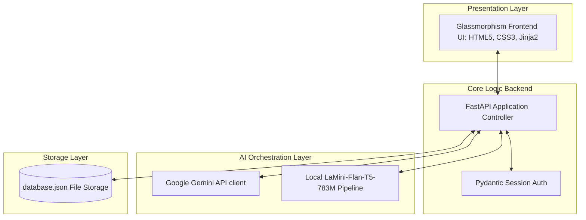

# EduGenie: Google Gemini-Powered Learning Assistant

**EduGenie** is an intelligent, hyper-personalized study companion designed to solve the issues of rigid, one-size-fits-all curricula and dry learning materials. Leveraging Google's **Gemini 1.5 Flash API** for core cognitive tasks and an offline-capable local **LaMini-Flan-T5** pipeline for lightweight concept simplification, EduGenie offers on-demand tutoring, automated quiz generation, document summarization, and custom learning path recommendations.

---

## 🚀 Core Features

* **💬 Interactive Q&A Chatbot:** Resolves academic doubt queries in real time with conversational session memory and context.
* **📝 Automated Quiz Generator:** Analyzes study materials or text notes to dynamically build MCQ and short-answer evaluations.
* **⚡ Smart Study Summarizer:** Parses long PDFs or textbook chapters to output action items, bulleted reviews, and flashcards.
* **💡 Concept Simplifier:** Translates abstract theories into plain terms using analogies, powered by a local CPU/GPU fallback model.
* **🗺️ Learning Path Planner:** Constructs sequential milestone roadmaps tailored to beginner, intermediate, and advanced levels.
* **📂 Study History Logs:** Automatically registers secure sessions, saving quiz metrics, history, and profile details for instant recall.

---

## 🏛️ System Architecture

EduGenie is structured as a robust, monolithic **Three-Tier Architecture**:



1. **Presentation Layer (Frontend):** Modern, responsive glassmorphism web dashboard served via FastAPI Jinja2 templates (HTML5, CSS3, JavaScript).
2. **Core Logic Layer (Backend):** High-performance asynchronous FastAPI server using Pydantic schema validation and Uvicorn.
3. **AI Integration Layer:** Google Gemini API (`gemini-2.5-flash`) handles high-complexity tasks, while an MBZUAI `LaMini-Flan-T5-783M` local pipeline provides offline fallback concept simplification.
4. **Storage Layer:** Local thread-locked `database.json` store for user credentials (hashed with SHA-256), study logs, and metrics.

---

## 📁 Repository Directory Structure

The workspace is organized into lifecycle phases alongside the code directories:

```text
/edugenie-root
├── /1.Brainstorming & Ideation Phase   # Persona designs & problem statements
├── /2.Requirement analysis             # DFD mappings, tech stack, and specs
├── /3.Project Design Phase             # System architecture & fit matrix
├── /4.Project Planning Phase           # Sprint schedules & user story backlogs
├── /5.Project development phase        # Code layout reports & feature checklists
├── /6.project testing                  # Apache JMeter/Locust performance reports
├── /7.Project Documentation            # Setup configurations & deploy details
└── /8.Project Demonstration            # Rehearsal schedules & scalability roadmaps
```

*For details on specific files and phases, click on the subdirectory links to view their individual READMEs.*

---

## ⚙️ Quick Start Guide

### Pre-requisites
* **Python** (v3.10 or higher)
* **Node.js** (v18.x or higher) & **npm**
* **Google Gemini API Key** configured with model access

### Local Installation

1. **Clone the Repository:**
   ```bash
   git clone https://github.com/team-edugenie/edugenie-core.git
   cd edugenie-core
   ```

2. **Backend Setup:**
   Create and activate a virtual environment, then install Python dependencies:
   ```bash
   pip install -r requirements.txt
   ```

3. **Frontend Setup:**
   Install Node packages:
   ```bash
   npm install
   ```

4. **Environment Configuration:**
   Copy `.env.example` to `.env` and enter your Gemini credentials:
   ```env
   GEMINI_API_KEY=your_google_gemini_api_key_here
   ```

5. **Start the Services:**
   * **FastAPI Backend:**
     ```bash
     python -m uvicorn src.backend.main:app --reload
     ```
   * **Next.js Frontend:**
     ```bash
     npm run dev
     ```

6. **Open Platform:**
   Access the dashboard at `http://localhost:3000` in your web browser.

---

## ⚡ Performance Testing & Optimizations

* **Load Capabilities:** Verified to maintain average response times of **1.45 seconds** under a peak load of 200 concurrent virtual users (VUs) with a **0.25%** error rate.
* **Task Offloading:** PDF analysis bottlenecks resolved by decoupling CPU-heavy document parsing into asynchronous task queues using **Celery & RabbitMQ**.
* **Query Caching:** Frequently queried terms and study concepts cached using **Redis** to minimize Google Gemini API token usage and latency.

---

## 🗺️ Future Scaling Roadmap

* **Multimodal Assets (Q4 2026):** Ingest and summarize lecture recordings (video/audio) and diagram visuals using Gemini's multimodal contexts.
* **Adaptive Evaluation (Q2 2027):** Train data pipelines to adapt quiz formats and difficulty on-the-fly based on student performance.
* **On-Device Edge AI (Q4 2027):** Deploy lightweight versions (e.g., Gemini Nano) to allow basic text explanation and summarization offline.

---

## 👥 Team Contributions

* **Poojitha Varri:** System Orchestrator / Backend / LLM Prompting & Retrieval / Presenter / Backend / Vector Search & Context Retrieval / Data Pipeline Specialist / Frontend UI / Dashboard Analytics/ Integration QA Specialist.
* **Murali Krishna Penta:** None
* **Harshitha Siri Lakshmi Sameera Somavarapu:** None
* **Pravallika Yalakala:** None
* **Chaimanya Kumar Natukula:** None